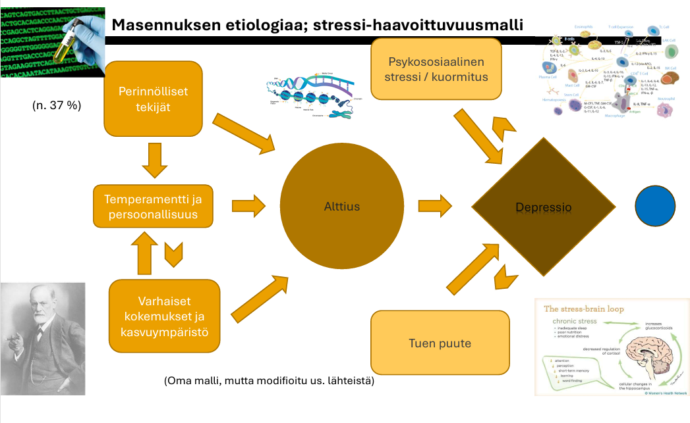
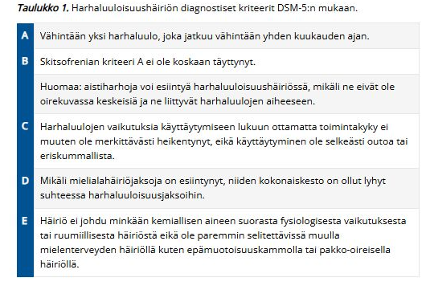
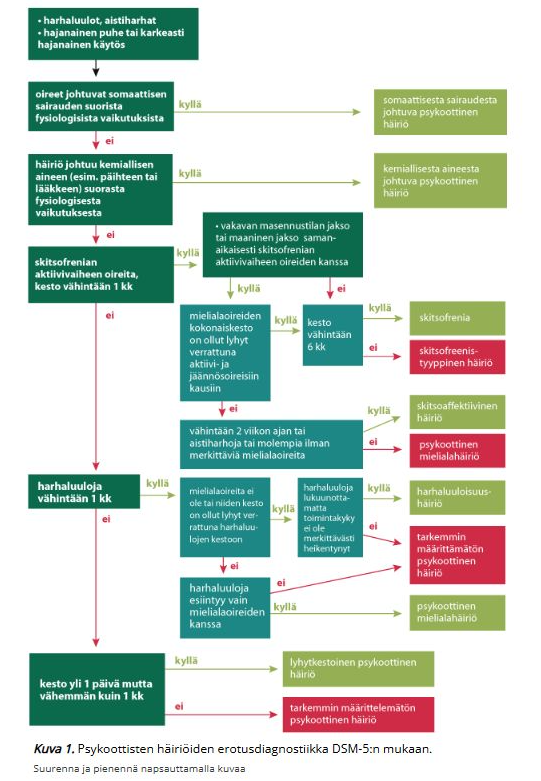
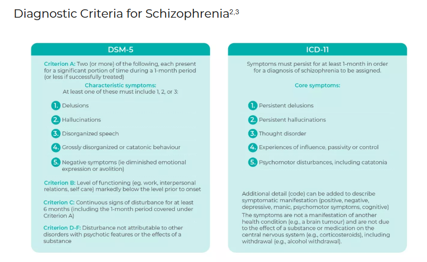

# 2008

## Skipattu vuosi 

Vuoden 2009 kysymyksiä ei ole wikissä. 

### Laihuushäiriön ydinoireet

  <button class="solution-button"
          data-label="Vastaus"
          data-hide-label="Piilota vastaus">
    Vastaus
  </button>
  

Anoreksian (anorexia nervosa, laihuushäiriö) ydinoireet voisi tiivistää näin: tarkoituksellisesti aiheutettu ja ylläpidetty nälkiintymistila, alipaino ja syömisen vakava rajoittaminen, jonka psykopatologisena taustana on pelko lihavuudesta ja ruumiinkuvan vääristyminen. Aliravitsemustila johtaa lopulta laaja-alaiseen endokriiniseen häiriöön ja aineenvaihdunnan hidastumiseen (bradykardia, hypotensio, hypotermia). Tyypillinen laihuushäiriö on helppo tunnistaa kliinisen kuvan perusteella. Painon laskun syiden selvittäminen voi joskus olla hankalaa, koska sairastunut rationalisoi oireensa, salaa rituaalinsa ja vastustaa hoitoon hakeutumista.

Erotusdiagnostisesti on syytä sulkea pois laihtumista aiheuttavat somaattiset sairaudet erityisesti silloin, kun laihuushäiriö alkaa tavallista myöhemmällä iällä, taudinkuva on epätyypillinen tai siihen liittyy runsaasti somaattisia oireita. Painon laskua voi liittyä joihinkin pitkäaikaisiin sairauksiin, kuten keliakiaan ja muihin imeytymishäiriöihin, kilpirauhasen liikatoimintaan, Addisonin tautiin tai diabetekseen. Huomioon on otettava myös pahanlaatuiset sairaudet, huumeiden käyttö ja HIV. Erottava piirre näissä somaattisissa sairauksissa on, että sairastunut on aidosti huolissaan painonlaskusta ja että esille ei tule vääristynyttä ruumiinkuvaa.

---

Tarkemmin tyyppipiirteet voi muistaa anoreksian ICD-10-kriteerien perusteella: 

1. Potilaan paino on vähintään 15 % alle pituuden mukaisen keskipainon tai BMI on korkeintaan 17,5 kg/m2.
2. Painon lasku on aiheutettu itse välttämällä "lihottavia" ruokia. Lisäksi saattaa esiintyä liiallista liikuntaa, itse aiheutettua oksentelua sekä ulostuslääkkeiden, nestettä poistavien tai ruokahalua hillitsevien lääkkeiden käyttöä
3. Potilas on mielestään liian lihava ja pelkää lihomista. Kyseessä on ruumiinkuvan vääristymä. Potilas asettaa itselleen alhaisen painotavoitteen
4. Todetaan laaja-alainen hypotalamus-aivolisäke-sukupuolirauhasakselin endokriininen häiriö, joka ilmenee naisilla kuukautisten puuttumisena ja miehillä seksuaalisen mielenkiinnon ja potenssin heikkenemisenä. Jos häiriö alkaa ennen murrosikää, kasvu ja murrosiän fyysiset muutokset viivästyvät tai pysähtyvät.
5. Bulimian kriteerit A ja B eivät täyty (= ei toistuvia ylensyömisjaksoja eikä ajattelua hallitse syöminen/voimakas halu syödä)

Epätyypillinen anoreksia tarkoittaa, että potilaalla on tyypillisiä anoreksian oireita, mutta jokin tai jotkin edellä mainituista diagnostisista kriteereistä (avainoireista) puuttuvat tai avainoireet esiintyvät lieväasteisina. 

--- 

Diagnostisten piirteiden lisäksi voi ilmentyä mm.

<li>anemiaa, elektrolyyttihäiriöitä (useimmiten hyponatremiaa ja hypokalemiaa; hypokalemia voi osittain johtua mahdollisesta purging-toiminnasta eli esim. oksentelusta)</li>
<li>pienentynyttä luutiheyttä (lopulta osteopenia/osteoporoosi -> murtumariski)</li>
<li>hidastunutta perusaineenvaihduntaa (bradykardia, hypotensio ja vähentyneet suoliäänet)</li>
<li>sydänfilmissä usein sinusbradykardia ja pidentynyt QT-aika</li>
<li>lanugokarvoitusta (utukarvoitus) eli havaitaan nukkamaista karvoitusta. Useimmiten lanugoa on vain sikiöillä (joskus vastasyntyneillä vielä pari viikkoa), mutta aikuisilla se usein viittaa vakavaan aliravitsemustilaan (voi ajatella, että lanugoa kasvaa tarkoituksena pitää aliravittu keho lämpimänä). </li>

  

### Kolme eri lääkeryhmään kuuluvaa ahdistuneisuuden hoidon lääkettä, niiden edut, haitat ja muut huomioon otettavat asiat

  <button class="solution-button"
          data-label="Vastaus"
          data-hide-label="Piilota vastaus">
    Vastaus
  </button>
  

Masennuslääkkeet ovat yleensä ensisijaisia pitkäaikaisissa ahdistuneisuushäiriöissä ja vielä niistä ensisijaisesti SSRIt (myös SNRIt); esimerkiksi essitalopraami (SNRI-lääkkeistä venlafaksiini). Muista msennuslääkkeistä esim. vortioksetiini, mirtatsapiini... ovat käytössä

<li>Edut: eivät aiheuta riippuvuutta, sopivat pitkäaikaiseen käyttöön ja tehoavat myös usein samanaikaiseen masennukseen</li>
<li>Haitat: Alussa usein ohimeneviä oireita, kuten pahoinvointia, päänsärkyä, hikoilua. Pitkäaikaisempia haittavaikutuksia ovat mm. seksuaalihaitat (libidon lasku, orgasmivaikeus), tunne-elämän latistuminen, vuotoalttius, harvinaisesti SIADH (hyponatremia).</li>
<li>Muu huomioon otettava: Vaikutus alkaa hitaasti (2-4 viikkoa) + aluksi annostelu voi lisätä ahdistusta, jonka takia annostelu aloitetaan pienemmällä annoksella ensimmäisen viikon ajan. Tulee myös ottaa huomioon se, että lääkityksen nopea lopetus voi aiheuttaa vieroitusoireita, jonka takia lopetus tehdään portaittain.</li>

---

Bentsodiatsepiinit, esim. alpratsolaami

<li>Edut: Vaikutus alkaa nopeasti (minuuteista tunteihin) ja ovat äärimmäisen tehokkaita akuutin ahdistuksen tai paniikkikohtauksen lievittämisessä. Myös tehokkaita unilääkkeitä.</li>
<li>Haitat: Riippuvuus- ja toleranssiriski. Väsymys ja sedaatio (välillä toivottukin vaikutus unilääkkeenä, mutta kaatumis- ja onnettomuusriski vaikutuksen vuotaessa seuraavalle päivälle). Muistin ja keskittymisen heikentyminen pidempiaikaisessa käytössä. Vieroitusoireet merkittäviä pitkäaikaisen käytön jälkeen. </li>
<li>Muu huomioon otettava: Alkoholin kanssa käyttö vaarallista. Ei suositella pitkäaikaiseen hoitoon (suositellaan päiviä-korkeintaan viikkoja). Määrämistä kotiin suositellaan vain tutuille potilaille.</li>

---

Buspironi

<li>Edut: Ei aiheuta riippuvuutta. Ei merkittävää sedaatiota. Ei seksuaalihaittoja. </li>
<li>Haitat: Huimaus, päänsärky, pahoinvointi mahdollisia</li>
<li>Muu huomioon otettava: Vaikutus alkaa hitaasti vasta 2-4 viikon kuluttua -> ei sovi tarvittaessa otettavaksi lääkkeeksi eikä tehoa hyvin paniikkikohtauksiin. Käytetään erityisesti yleistyneen ahdistuneisuushäiriön (GAD) hoidossa SSRI-lääkkeiden rinnalla tai jos SSRI-lääkkeitä ei voi käyttää esim. seksuaalihaittojen takia.</li>

  

### Masennusta laukaisevat tekijät

  <button class="solution-button"
          data-label="Vastaus"
          data-hide-label="Piilota vastaus">
    Vastaus
  </button>
  

Masennus ymmärretään stressi-haavoittuvuusmallin tai biopsykososiaalisen mallin perusteella. 

Haavoittuvuus = Perinnölliset tekijät, persoonallisuus ja varhaiset kokemukset/kasvuympäristö -> alttius masennukselle 

Itse laukaiseva tekijä alttiilla henkilöllä voi olla psykososiaalisesta stressistä/kuormituksesta, tuen puutteesta tai terveydellisistä/fyysisistä tekijöistä johtuvaa. 

<li>Psykososiaalinen stressi: Esim. menetykset, työstressi/työttömäksi joutuminen, suuret elämänmuutokset yleisesti</li>
<li>Tuen puute: Yksinäisyys vähentää kyvykkyyttä selviytyä psykososiaalisesta stressistä ja muista tekijöistä</li>
<li>Terveydelliset tekijät: Esim. aikaisemmat/uudemmat somaattiset sairaudet, kuten kilpirauhasen toimintahäiriöt, aivoinfarktit, krooninen kipu. Päihteet tulee aina muistaa ja kartoittaa (esim. alkoholi). Pitkittyneesti heikko uni myös voi laukaista masennuksen.</li>

  

### Harhaluuloisuushäiriön oireet

  <button class="solution-button"
          data-label="Vastaus"
          data-hide-label="Piilota vastaus">
    Vastaus
  </button>
  

Harhaluuloisuushäiriö tarkoittaa, että potilaalla on todellisuuden vastainen uskomus (deluusio, harhaluulo) vähintään yhden kuukauden ajan **ilman toimintakyvyn merkittävää heikentymistä.** Jos harhaluulosta ei puhuta, henkilö voi vaikuttaa täysin tavalliselta, käydä töissä ja hoitaa asiansa. Käytös muuttuu oudoksi vain, kun aihe liippaa harhaluulon piiriä. Jos harhaluuloja kyseenalaistetaan, potilas voi muuttua vihaiseksi, hyökkääväksi tai masentuneeksi.

Harhaluulo on määriteltävissä todellisuuden vastaiseksi uskomukseksi, josta henkilö pitää ehdottomasti kiinni, vaikka hänelle esitettäisiin vakuuttavia todisteita uskomuksen paikkansapitämättömyydestä. Usein ilmenee non-bisarreina deluusioina (teknisesti siis mahdollisia uskomuksia). 

Harhaluuloisuushäiriöitä on harhaluulon luonteen mukaan erityyppisiä. Tavallisin alatyyppi on vainoharhainen eli paranoidinen häiriö. Siinä henkilö uskoo (perusteettomasti), että häntä tai jotakuta hänen läheistään vainotaan, tarkkaillaan, yritetään vahingoittaa tai ylipäätään kohdellaan jollain tavoin kaltoin.

<li>Muita tyyppejä ovat mm. mustasukkaisuusharhaisuus (uskoo kumppaninsa olleen tai olevan uskoton), erotomaaninen harhaisuus (on varma jonkun ja yleensä itseään korkeammassa asemassa olevan henkilön rakkaudesta itseensä), suuruusharhaisuus (on harhaluuloja mahtavasta vallasta, voimasta, tietämyksestä, identiteetistä tai erityisestä suhteesta jumaluuteen tai kuuluisaan henkilöön) ja somaattisharhaisuus (uskoo vakaasti ja perusteetta, että hänellä on jokin fyysinen sairaus tai vamma).</li>

---

Harhaluuloisuushäiriö eroaa skitsofreniasta siten, että skitsofrenian diagnostiset kriteerit eivät täyty. Aistiharhojakin voi sinänsä esiintyä harhaluuloisuushäiriössä, mikäli ne eivät ole oirekuvassa keskeisiä ja ne liittyvät harhaluulojen aiheeseen. Skitsofrenian A-kriteeri ei kuitenkaan koskaan täyty. 

  

