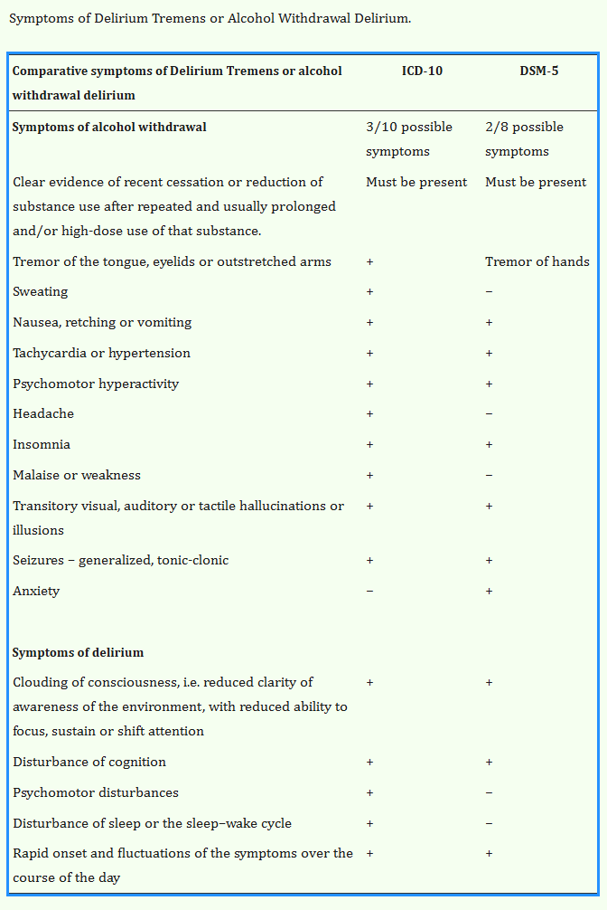
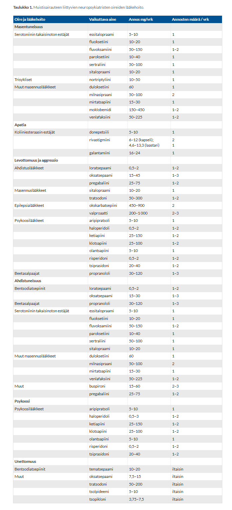

# 2007 

## Tentti

Aiheet myötäilevät paljon myöhempien tenttien aiheita, mutta tässä hyvää kertausta ainakin. 

### Alkoholideliriumin diagnoosi

  <button class="solution-button"
          data-label="Vastaus"
          data-hide-label="Piilota vastaus">
    Vastaus
  </button>
  

Alkoholidelirium eli delirium tremens (juoppohulluus) voi kehittyä jo 1–6 vuorokautta pitkään kestäneen ja runsaan alkoholinkäytön lopettamisen jälkeen. Alkoholivieroitusoireet ilmaantuvat lopettamisen jälkeen n. 24–150 tunnin kuluessa. Vieroitusoireita ilmaantuu, kun päihteeseen sopeutuneen hermoston toiminta muuttuu äkkiä päihteen poistuessa elimistöstä. Hermoston adaptaatio päihteeseen jää jäljelle, ja hermosto tulee "yliaktiiviseksi". 

Huippu on tyypillisesti n. 70–100 tunnin kohdalla, jolloin delirium tremensin ja alkoholiepileptisten kouristuskohtausten todennäköisyys on suurin. 

Delirium tremensin diagnoosi perustuu pääasiassa kliiniseen kuvaan ja anamneesiin; tukena myös alkoholia tutkivat labrat (esim. Peth; näiden labrojen lisäksi tietystä myös mm. elektrolyyttien tutkiminen yms). Tyypillisiä piirteitä ovat tajunnan häiriö, kognitiiviset muutokset (näköharhat, muut aistiharhat, lyhytkestoisen muistin heikkeneminen) ja autonomisen hermoston ylivireys (vapina, hikoilu, takykardia, hypertensio, unettomuus). 

Delirium tremens on hengenvaarallinen tila (hoitamattomaan deliriumiin arvioidaan liittyvän 20 %:n kuolleisuus). Kuolema aiheutuu hypertermiasta, neste- ja elektrolyyttitasapainon häiriöistä, infektioista tai sydän- ja verenkiertoelimistön toiminnan pettämisestä. Delirium on somaattisessa sairaalahoidossa hoidettava tila.

Vaikka delirium tremens onkin hoitamattomana hengenvaarallinen tila, se menee asianmukaisella hoidolla muutamassa vuorokaudessa ohi. Hoito perustuu olennaisin osin riittävään lääkitykseen, jossa käytetään ensi sijassa suuria annoksia diatsepaamia tai muita bentsodiatsepiineja, joskus lisäksi myös psykoosilääkkeitä. Näiden lisäksi alkoholiriippuvuuden hoito muutenkin, eli esim. tiamiini tärkeää muistaa, elektrolyyttihäiriöiden korjaaminen aiheellista yms. 

  

### Suisidiriskiä lisäävät tekijät

  <button class="solution-button"
          data-label="Vastaus"
          data-hide-label="Piilota vastaus">
    Vastaus
  </button>
  

Ajankohtaisia riskitekijöitä ovat mm:

<li>Psykologiset riskitekijät: toivottomuus, negatiiviset odotukset elämältä, yleinen elämään tyytymättömyys, impulsiivisuus</li>
<li>Kielteiset elämäntapahtumat (erityisesti erot, menetykset, voimakasta häpeää tai syyllisyyttä aiheuttavat tapahtumat, erityisesti nuorilla riidat ja pettymykset laukaisevia tekijöitä itsetuhoisen käyttäytymisen taustalla</li>
<li>Psykiatrisen sairauden vaikea vaihe (esim. psykoottinen depressio, kaksisuuntainen mielialahäiriö, skitsofrenia, päihteiden hallitsematon käyttö)</li>
<li>Valmis ja toteutettavissa oleva tsemurhasuunnitelma</li>
<li>Välineistö toteuttaa itsemurha</li>

---

Pitkäaikaisia riskitekijöitä ovat mm:

<li>Oma tai lähipiirin aiempi itsetuhoisuus</li>
<li>Heikko tuki sosiaalisessa ympäristössään; ei läheisiä</li>
<li>Mielenterveyden häiriöt</li>
<li>Somaattiset sairaudet (erityisesti kroonista kipua aiheuttavat)</li>
<li>Miessukupuoli</li>
<li>Matala sosiekonominen asema (työttömyys, pienituloisuus)</li>
<li>Aiemmat kuormittavat elämäntapahtumat</li>
<li>Varsinkin vanhuksilla yksinäisyys, kokemus tarpeettomuudesta, suru</li>

  

### Miten hoidat dementiapotilaan käytöshäiriöitä

  <button class="solution-button"
          data-label="Vastaus"
          data-hide-label="Piilota vastaus">
    Vastaus
  </button>
  

Muistisairauksiin liittyy usein hermoston poikkeavasta toiminnasta johtuvia neuropsykiatrisia oireita, joita tavallisimmin kutsutaan käytösoireiksi. Tällaisia ovat esimerkiksi potilaalle epätavanomainen käyttäytyminen, todellisuudentajun vääristyminen tai mielialaoireet. Jopa 90 prosentilla muistisairaista on käytösoireita jossain sairauden vaiheessa ja puolella useita käytösoireita samanaikaisesti. Oireet vaikuttavat potilaan ja hänen läheistensä elämänlaatuun sekä lisäävät sosiaali- ja terveydenhuollon palvelujen käyttöä sekä laitoshoidon tarvetta. 

Neuropsykiatrisia oireita **pitää hoitaa pääsääntöisesti silloin, kun ne rasittavat potilasta tai heikentävät kykyä huolehtia itsestä, sosiaalista vuorovaikutusta tai toimintakykyä.** Hoito on aiheellista myös silloin, kun oireet aiheuttavat vaaratilanteita potilaalle itselleen tai muille, oireet vaikuttavat hoitopaikkaratkaisuun tai omaiset eivät enää niiden vuoksi jaksa hoitaa potilasta. 

Lievien oireiden osalta noin 1 kuukauden tiiviimpi seuranta voi antaa kuvaa oireiden laadusta ja aikaa itsestään väistyvien oireiden poistumiselle. 

---

**Hoidossa on tavallisesti aiheellista soveltaa sekä psykososiaalisia hoitomuotoja että määrätä lääkehoitoa.**

Lääkkeettömällä hoidolla tarkoitetaan ensisijaisesti sitä, että muistipotilaasta ja hänen tarpeistaan huolehditaan mahdollisimman tarkoituksenmukaisesti. Hoitoyhteisön ja -ympäristön avulla kompensoidaan puutteita ja tuetaan jäljellä olevaa toimintakykyä. **Muistipotilasta hoitavia omaisia voidaan opastaa neuropsykiatristen oireiden hoidossa ja kannustaa osallistumaan dementiayhdistysten ja omaisryhmien toimintaan.** Myös omaisten mielenterveydestä tulee huolehtia ja masennusoireita tulee hoitaa (normaalien periaatteiden mukaan). Jokaiselle muistipotilasta hoitavalle omaiselle pitäisi tarjota mahdollisuus osallistua sopeutumisvalmennuskurssille.

**Lääkehoidossa muistisairauslääkkeet ovat ensisijaisia lääkkeitä myös muistisairauteen liittyvien neuropsykiatristen oireiden hoidossa. Erilaisten oirekuvien yhteydessä käytetään vielä erilaisia tilanteeseen sopivia lääkkeitä:**

Varsinkin masennustiloissa voidaan käyttää tyypilliseen tapaan masennuslääkkeitä. Sähköhoitoa suositellaan yleisesti muistisairauksiin liittyvien vakavien masennustilojen hoitoon silloin, kun muut hoidot eivät ole riittävän tehokkaita, kun oireistoon liittyy psykoottisia piirteitä tai kun potilaalla on korostunut itsemurhavaara. Myös levottomuuden ja aggressiivisuuden hoidossa sähköhoito voi joissakin tapauksissa tulla kyseeseen silloin, kun muut hoitomuodot eivät riitä. 

Apatiaoireissa (mielenkiinnon, motivaation ja aloitekyvyn katoamasta sekä tunteiden (affektien) latistumista) voidaan myös harkita esim. dopamiinivälitteiseen hermotoimintaan vaikuttavaa metyylifenidaattia, joka tulee kyseeseen silloin, kun apatian arvioidaan merkittävästi vaikuttavan potilaan elämänlaatuun. Apatiaan ei aina liity subjektiivinen kärsimys kuten esimerkiksi vaikeaan masennustilaan, minkä vuoksi lääkityksen indikaatio tulee punnita huolellisesti.

Levottomuusoireissa lievistä ja tilannesidonnaisista aggressio- ja agitaatio-oireista kärsiville voidaan antaa esilääkkeenomaisesti puolta – yhtä tuntia ennen hoitotoimenpidettä pieni annos bentsodiatsepiinia. Vaikeammissa oireissa, joihin liittyy ärtynyttä dysforiaa, ovat psykoosilääkkeiden lisäksi serotoniinin takaisinoton estoon perustuvat masennuslääkkeet mahdollinen hoitovaihtoehto. Vaikeiden agitaation ja aggression muotojen hoitoon on yleisesti käytetty psykoosilääkkeitä. 

Ahdistuneisuusoireissa bentsoja jos tarve on lyhytkestoinen ja satunnainen, masennuslääkkeitä jos tarve pidempiaikainen.

Psykoosioireissa psykoosilääkkeitä; yleensä toisen polven lääkkeet parempia haittavaikutusprofiilin takia. 

Koska neuropsykiatrisissa oireissa tapahtuu muutoksia muistisairauden edetessä, tulee lääkehoidon tarpeellisuutta arvioida säännöllisesti ainakin 3–6 kuukauden välein hoitosuunnitelman tarkistamisen yhteydessä.

---

Kannattaa vielä muistaa muut selittävät syyt, kuten kipu: muistisairas ei aina osaa sanoa, mihin sattuu. Kipu voi ilmetä huutona tai aggressiivisuutena. Myös infektioita tulee etsiä, koska ne voivat pahentaa oireilua (esim. VTI). 

  

### Sosiaalisen fobian lääkehoito

  <button class="solution-button"
          data-label="Vastaus"
          data-hide-label="Piilota vastaus">
    Vastaus
  </button>
  

Sosiaalisen fobian (sosiaalisten tilanteiden pelon) keskeisiä piirteitä ovat sosiaalisten tilanteiden aiheuttama voimakas ahdistuneisuus ja siihen liittyvä välttämiskäyttäytyminen. Hoidossa käytetään yleensä kahta eri lähestymistapaa: jatkuvaa lääkitystä perusoireisiin ja tarvittavaa lääkitystä jännityksen fyysisiin oireisiin.

**Ensisijainen jatkuva lääkehoito on yleensä SSRI,** kuten muutenkin pitkäaikaisissa ahdistuneisuushäiriöissä. Myös venlafaksiinia (SNRI) käytetään usein.

Tarvittavana lääkityksenä voidaan usein ehdottaa **beetasalpaajaa (erityisesti propranololi) auttamaan; erityisesti jos potilaalla on esiintymisjännitystä** ja osaa ennustaa oireiden ajankohdan. Beetasalpaajien käyttöalue sosiaalisen fobian hoidossa rajoittuu kapea-alaisiin esiintymisfobioihin, joissa ne voivat olla tilannekohtaisesti hyödyksi estäessään sympaattisen hermoston aktivoitumisen somaattisia oireita vaikeasta esiintymisjännityksestä kärsivällä. Beetasalpaajien annostelu riippuu potilaasta; voi kokeilla esim. _Propral 10mg x1 n. tunti ennen ahdistavaa tapahtumaa;_ jotkut vaativat jopa 40-80mg annoksen. 

---

Bentsodiatsepiineja voidaan käyttää _tarvittaessa_ (huom! ei siis säännöllisesti ja pitkäaikaisesti) vaikeisiin oireisiin edellyttäen, että lääkehoidon seuranta on toteutettu asianmukaisesti.

---

Lääkehoidon ulkopuolella psykoterapia on tärkeää hoidossa. 
  

